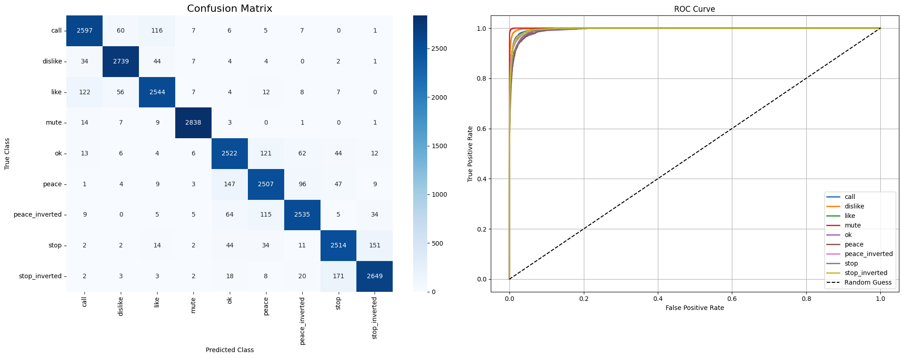

# Hand Gesture Classification

## Project Overview
This project implements a modular Deep Learning pipeline for classifying hand gestures using the **HAGRID (HAnd Gesture Recognition Image Dataset)**. It benchmarks multiple architectures (VGG, ViT, ResNet, InceptionV1) to analyze performance trade-offs.

The system is designed with **MLOps best practices**:
- **Modular Codebase:** Separated logic for data processing, model definitions, and training.
- **Experiment Tracking:** Integrated TensorBoard logging (local & remote via Ngrok).
- **Custom Data Pipeline:** Automated filtering, splitting, and loading of large-scale datasets.
- **Hybrid Modeling:** Supports both custom implementations (VGG from scratch) and Transfer Learning.

## Key Features
- **Data Sanity Checks:** implemented visualization pipelines to debug data augmentation strategies (e.g., ensuring `RandomErasing` does not occlude the Region of Interest/Hand).
- **Model Benchmarking:** Comparative analysis of CNNs (VGG, Inception, ResNet) vs. Transformers (ViT).
- **MLOps Workflow:** Modularized code, reproducibility checks, and remote monitoring.

## Project Structure
```text
├── notebooks/           # Jupyter Notebooks for Training & Testing
├── utils/               # Helper modules
│   ├── data_utils.py    # Data ingestion, filtering, and DataLoader creation
│   ├── model_utils.py   # Model factory (VGG, ViT, ResNet, Inception)
│   ├── train_utils.py   # Training loop, checkpoints, and early stopping
│   └── vis_utils.py     # Data sanity checks, augmentation debugging, and evaluation metrics
├── tensorboard_logs/    # Training logs
├── vgg.py               # Custom VGG implementation
└── requirements.txt     # Dependencies
```

## Installation
**1. Clone the Repository**
```bash
git clone https://github.com/mazennh/Gesture-Classification.git
cd Gesture-Classification
```
**2. Install Dependencies**
```bash
pip install -r requirements.txt
```
**3. Path Setup (For Notebooks/Colab)**
```python
import sys
import os
sys.path.append(os.path.abspath("/path/to/Gesture-Classification"))
```

## Usage Workflow
**1. Training Pipeline**

The training process handles data engineering (filtering/splitting) and model optimization.

*Located in: `notebooks/model/train.ipynb`*

**Key Steps:**
1. **Data Filtering**: Extracts specific classes from the massive HAGRID dataset.
2. **Splitting**: 80% Train, 10% Validation, 10% Test (Seed: 42).
3. **Training**: Uses Adam Optimizer, StepLR Scheduler, and Early Stopping.

**Example Code:**

```python
import torch
import torch.nn as nn
from torch.optim import Adam
from torch.optim.lr_scheduler import StepLR
from utils import data_utils, train_utils, model_utils
device = "cuda" if torch.cuda.is_available() else "cpu"

# 1. Prepare Data
data_utils.filter_data(
    input_path='/path/to/raw_data',
    output_path='/path/to/filtered_data',
    classes_list=["stop", "like", "dislike", ...],
    split_ratio=(0.8, 0.1, 0.1)
)

# 2. Create Loaders
train_dl, val_dl, test_dl, _, class_names, _ = data_utils.create_dataloaders(
    data_dir='/path/to/split_data', 
    batch_size=32
)

# 3. Initialize Model (e.g., VGG, ViT, ResNet)
model, name = model_utils.get_model(model_name='vgg', num_classes=len(class_names), device=device)

# 4. Define Hyperparameters
loss_fn = nn.CrossEntropyLoss()
optimizer = Adam(model.parameters(), lr=0.001)
scheduler = StepLR(optimizer, step_size=5, gamma=0.1)

# 5. Train
train_utils.train(
    model=model,
    train_dataloader=train_dl,
    val_dataloader=val_dl,
    optimizer=optimizer,
    loss_fn=loss_fn,
    epochs=20,
    device=device,
    patience=5,
    scheduler=scheduler,
    experiment_name='vgg_run_1',
    best_model='vgg_best.pth'
)
```
**2. Testing & Monitoring Pipeline**

The testing pipeline is designed to run on **deployment artifacts** (zipped weights and logs).

 It reconstructs the test environment to verify performance.

*Located in: `notebooks/model/test.ipynb`*

**Key Steps:**
1.  **Artifact Setup:** Unzips the training output (Split Data, Best Model, Logs).
2.  **Data Reconstruction:** Re-creates the `test_dataloader` from the split directory.
3.  **Inference:** Loads the saved model weights and evaluates metrics.
4.  **Monitoring:** Visualizes logs via TensorBoard (local or Ngrok).

**Inference Example:**
```python
import torch
import torch.nn as nn
from utils import data_utils, model_utils, vis_utils
device = "cuda" if torch.cuda.is_available() else "cpu"

# 1. Setup DataLoaders
dls = data_utils.create_dataloaders(
    data_dir="/path/to/unzipped_data/splited_data",
    batch_size=32
)
_, _, test_dataloader, _, class_names, _ = dls

# 2. Load Model Architecture & Weights
best_model, _ = model_utils.get_model(model_name='vgg', num_classes=len(class_names), device=device)
best_model.load_state_dict(torch.load('/path/to/unzipped_data/best_model.pth'))

# 3. Evaluate
loss_fn = nn.CrossEntropyLoss()
vis_utils.evaluate_best_model(model=best_model,
                              loss_fn=loss_fn,
                              dataloader=test_dataloader,
                              class_names=class_names,
                              device=device)
```

## Monitoring Options:

**1. Remote (via Ngrok)**

Best for Google Colab / Kaggle environments.

```python
import subprocess
import os
from pyngrok import ngrok

# 1. KILL previous processes
os.system("pkill -f tensorboard")
ngrok.kill()

# 2. HIDE TensorFlow Warnings
os.environ['TF_CPP_MIN_LOG_LEVEL'] = '3' 

# 3. Authenticate Ngrok
ngrok.set_auth_token("YOUR_TOKEN_HERE") 

# 4. Start the Tunnel
try:
    public_url = ngrok.connect(6006).public_url
    print(f"TensorBoard is live at: {public_url}")
except Exception as e:
    print(f"Ngrok Error: {e}")

# 5. Start TensorBoard Silently
subprocess.Popen(
    ['tensorboard', '--logdir', '/kaggle/working/unzipped_data/runs', '--host', '0.0.0.0', '--port', '6006'],
    stdout=subprocess.DEVNULL,
    stderr=subprocess.DEVNULL
)
```

**2. Local (via CLI)**

Best if you downloaded the logs to your local machine.

Open your terminal/command prompt and run:
```bash
tensorboard --logdir="path/to/downloaded/runs" --port 6006
```
Then open your browser at `http://localhost:6006`.

## Results

| Model | Accuracy | F1-Score (Weighted) | AUC Score | Remarks |
|-------|----------|---------------------|-----------|---------|
| **VGG** (Custom) | 11.37% | 0.02 | 0.5000 | **Underfitting** (Failed to converge). |
| **InceptionV1** | 81.25% | 0.81 | 0.9808 | **Robust Generalization** (Strong regularization effects). |
| **ResNet** | 80.47% | 0.80 | 0.9800 | **Robust Generalization** (Strong regularization effects). |
| **ViT** | **92.66%** | **0.93** | **0.9965** | **Best Performance** (State-of-the-Art) |


*(Fig 1. Confusion Matrix and ROC curve for ViT)*

## Analysis & Key Observations
1.  **Vision Transformer (ViT) Superiority:**
    - ViT achieved the highest accuracy (**92.66%**) and generalization. 
    - **Why?** The **Self-Attention mechanism** allows the model to capture global context immediately, focusing on hand structure while ignoring complex backgrounds more effectively than the CNN baselines.

2.  **Impact of Strong Regularization (ResNet/Inception):**
    - Both ResNet and Inception exhibited an interesting phenomenon where **Test Accuracy (~80%) exceeded Training Accuracy (~61%)**.
    - **Root Cause:** This suggests that the **Data Augmentation strategy** (e.g., Random Erasing, Rotation) and **Dropout** layers made the training task significantly harder than the inference task. The models learned robust features from the difficult training samples, performing exceptionally well on the "clean" test data.

3.  **VGG Convergence Failure:**
    - The custom VGG model trained from scratch failed to converge (11% accuracy). 
    - **Insight:** This highlights the difficulty of training deep CNNs on limited data without **Pre-trained Weights (Transfer Learning)** or advanced normalization techniques.

## Contact
- **LinkedIn:** https://www.linkedin.com/in/mazenh-elhusseiny/
- **Email:** mazenh.elhusseiny@gmail.com